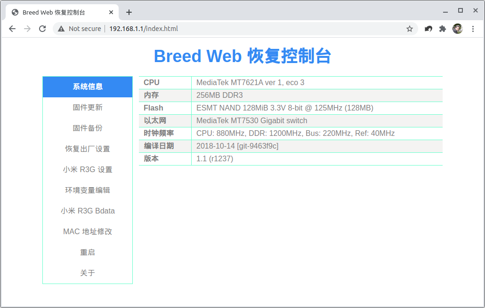
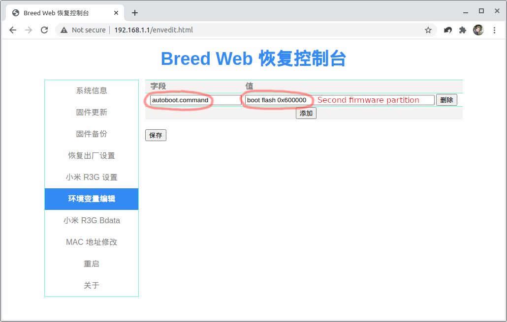
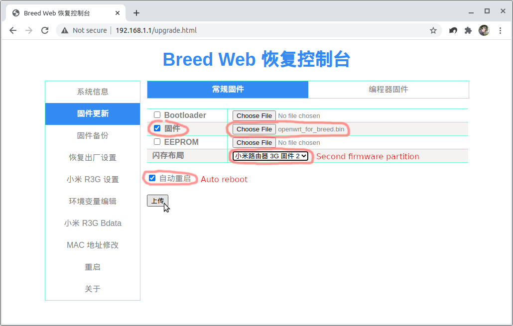

# Breed Image Maker for Xiaomi Mi WiFi R3G

This is a Linux shell script to create Breed-compatible OpenWrt images for Xiaomi Mi WiFi router 3G.

Breed stands for [Boot and Recovery Environment for Embedded Devices (BREED)](https://breed.hackpascal.net/). Installing it is out of scope of this guide.

With this script, flashing your router with the new firmware is as easy as 1-2-3.

1. Download the [official R3G OpenWrt](https://openwrt.org/toh/xiaomi/mir3g) `kernel1.bin` and `rootfs0.bin` images.

2. Run the script to create the Breed image:

```console
❯ ./make_mir3g_breed_image.sh openwrt-19.07.4-ramips-mt7621-xiaomi_mir3g-squashfs-kernel1.bin openwrt-19.07.4-ramips-mt7621-xiaomi_mir3g-squashfs-rootfs0.bin
openwrt_for_breed.bin successfully created.
```

3. Boot into Breed and flash the new image:

- Power off your router. Look for a pinhole on the back, power the router on while pressing and holding the button inside the pinhole.
- Release the button when you see the orange/yellow light blinking.
- Connect your laptop/PC directly to one of the two router ethernet LAN ports.
- Open your browser and type [http://192.168.1.1](http://192.168.1.1) into the address bar.
- You should be able to access the Breed web interface. It is in Chinese so follow the screenshots.

  [](breed1.png "Breed web interface")

- Select the sixth button on the left menu. You should be located at [http://192.168.1.1/envedit.html](http://192.168.1.1/envedit.html).
  I flash OpenWrt to the second partition so type `autoboot.command` and `boot flash 0x600000` here if you would like to do the same.

  [](breed2.png "Enter the autoboot command")

- Select the second menu button. You should be located at [http://192.168.1.1/upgrade.html](http://192.168.1.1/upgrade.html) now.
  Select the built firmware file `openwrt_for_breed.bin` on the second row of the form, select the second partition from the dropdown menu on the fourth row, then press the last button on the bottom of the form to start flashing.

  [](breed3.png "Flash the image")

- Wait for the progress bar to complete, the router should reboot automatically.

That's it.
